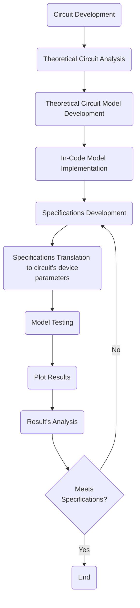

# 8x Gain, Temperature-Insensitive Residue Amplifier Modelling

This repository features ```Python®``` scripts used for performing the modelling and initial theoretical approach to the development of analogue integrated circuits. Convetinally, scientists and engineers use ```MATLAB®``` to develop models of the system they're implementing, but in it is time modelling affairs start being perfomed by using an open-source, community-supported language and associated packages - such as ```Python®```!\
In this case, an 8x Gain, temperature-insensitive residue amplifier for a SAR assisted Pipeline ADC is being modelled.\
The repository file tree diagram can be represented as given:
```Python
amplifier_modelling/
|-- amplifier_modelling/
|   |-- data/ # folder with .yaml files containing models info
|   |   /
|   |-- __init__.py
|   |-- cmos_model.py #cmos devices models
|   |-- amp_model.py # amplifier modelling
|   |-- read.py # read models and specifications f/ disk
|   |-- write.py # save model and specifications t/ disk
|   |-- util.py # utilities file providing graphing and timing func wrappers
|   /
|-- docs/
|   |-- images/ # folder with the article's figs.
|   |-- main.md # report of the modelling work
|   /
/
```
## Methodology
The methodology used while developping the scripts to conceive the models of the target system, and checking afterwards if the implemented system meets the specified requirements is given by the following state diagram:

## Running the tests
The following commands were used, in order to run the tests regarding the validation of the design:
```Python
# with poetry (python package manager)
poetry run python -m unittest tests/test_amplifier_modelling.py

# without poetry
python -m unittest tests/test_amplifier_modelling.py
```
**Dependencies**:
- poetry - package manager for Python
- unittest - unit/atomic testing package for Python
- PyYAML - Python YAML parser package for loading and saving model information.
- Matplotlib - to plot and save 2D and 3D graphs.