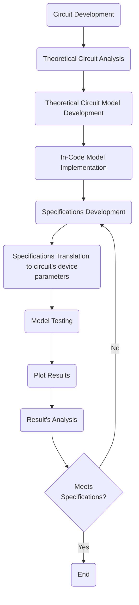
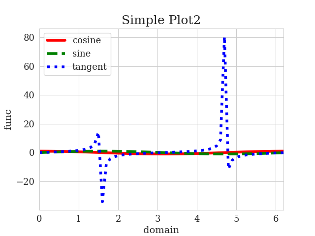
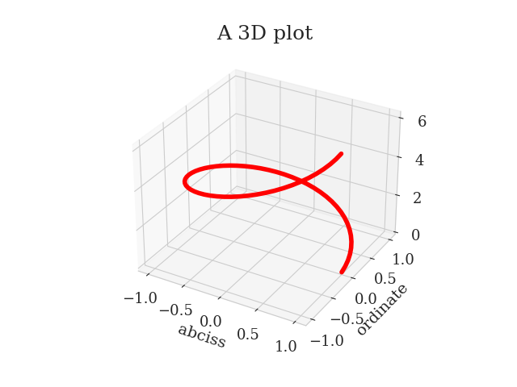
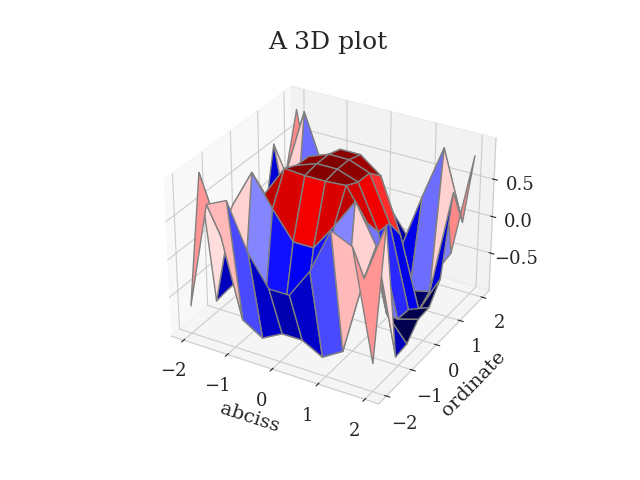
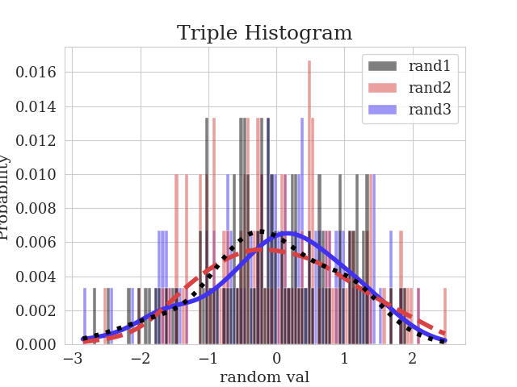

# Utilities package for Analog Integrated Circuit Modelling

This repository features ```Python®``` scripts used for performing the modelling and initial theoretical approach to the development of analogue integrated circuits. Convetionally, scientists and engineers use ```MATLAB®``` to develop models of the system they're implementing, but it is time modelling affairs start being perfomed by using an open-source, community-supported language and associated packages - such as ```Python®```!
## Methodology
The methodology used while developping the scripts to conceive the models of the target system, and checking afterwards if the implemented system meets the specified requirements is given by the following state diagram:

### Examples
Creating a 2D plot:
```Python
import numpy as np
from modelling_utils import plot_function
x = np.arange(0, 2*(np.pi), 0.1)
yy =[
    np.cos(x),
    np.sin(x),
    np.tan(x)
]
plot_function(
    x=x, y=yy, 
    labels=["cosine", "sine", "tangent"], 
    xlabel="domain", ylabel="func", 
    title="Simple Plot2", filename="test2.png"
)
```
Output:


Creating a 3D line plot:
```Python
import numpy as np
from modelling_utils import plot_function
z = np.arange(0, 2*(np.pi), 0.1)
x = np.cos(z)
y = np.sin(z)
plot_function(
    x=x, y=y, z=z, 
    labels=["3D func"], 
    xlabel="abciss", ylabel="ordinate", 
    title="A 3D plot", filename="line3d.png"
)
```
Output:


Creating a 3D surface plot:
```Python
import numpy as np
from modelling_utils import plot_function
x2 = np.outer(np.linspace(-2, 2, 10), np.ones(10))
y2 = x2.copy().T
z2 = np.cos(x2 ** 2 + y2 ** 3)
plot_function(
    x=x2, y=y2, z=z2, 
    labels=["3D func"], 
    xlabel="abciss", ylabel="ordinate", 
    title="A 3D plot", 
    type="surface", 
    filename="surface3d.png"
)
```
Output:


Creating an histogram plot:
```Python
import numpy as np
from modelling_utils import plot_hist
xx = [
    np.random.randn(100),
    np.random.randn(100),
    np.random.randn(100)
]
plot_hist(
    data=xx, 
    labels=["rand1","rand2","rand3"], 
    xlabel="random val", 
    title="Triple Histogram", 
    show=True, filename="hist2.png"
)
```
Output:


Reading a CMOS DC Operating Point Look Up Table:
```Python
from modelling_utils import read_lut
path = "../simulations/pcell/vbs-0_lx-1_sweep-vsg-vsd.csv"
df_lut = read_lut(path)
print(df_lut)
```
Output:
```
     vearly   vdsat  self_gain  region            id  gmoverid ...
0     0.000  0.1014      0.000     0.0  1.524000e-51     0.000 ...
1     0.000  0.1015      0.000     0.0 -1.323000e-14     0.000 ...
2     0.000  0.1015      0.000     0.0 -5.080000e-14     0.000 ...
3     0.000  0.1016      0.000     3.0 -1.172000e-13     0.000 ...
4     0.000  0.1017      0.000     3.0 -2.183000e-13     0.000 ...
..      ...     ...        ...     ...           ...       ...
320   5.422  0.4181      9.330     2.0  2.285000e-03     1.721 ...
321   5.708  0.4459      8.979     2.0  2.480000e-03     1.573 ...
322   5.947  0.4740      8.589     2.0  2.674000e-03     1.444 ...
323   6.136  0.5023      8.165     2.0  2.866000e-03     1.331 ...
324   6.275  0.5308      7.716     2.0  3.055000e-03     1.230 ...

[325 rows x 21 columns]
```

Reading Devices Specifications for sizing through Gm/Id method:
```Python
from modelling_utils import (
    read_specs,
    Devices
)
path = "../foo/bar/specs.toml"
devices=read_specs(path2)
print(devices)
```
Output:
```
    name[] type[]  vds[V]  vsb[V]  gm_id[SA^-1]          l[m] ...
m0     m0    nch    0.15     0.0          20.0  3.000000e-08 ...
m1     m1    nch    0.15     0.0          20.0  3.000000e-08 ...
m2     m2    pch   -0.15    -0.0          20.0  3.000000e-08 ...
m3     m3    pch   -0.15    -0.0          20.0  3.000000e-08 ...

[4 rows x 27 columns]
```
Where the ```specs.toml``` file looks like this:
```toml
# all units except circuit gain are specified in International System (SI)
[control] # control parameters for each device of the circuit
devices=["m0","m1","m2","m3"]
m0={type="nch", gmoverid=20, l="30 n", vds="150 m", id="1 m", vsb=0}
m1={type="nch", gmoverid=20, l="30 n", vds="150 m", id="1 m", vsb=0}
m2={type="pch", gmoverid=20, l="30 n", vsd="150 m", id="1 m", vbs=0}
m3={type="pch", gmoverid=20, l="30 n", vsd="150 m", id="1 m", vbs=0}

[spit] # output control variables
outputdir="./output"
# define which values are to be observed through vars
vars={m0=["all"], m1=["vgs","cgs", "ft", "self_gain"], m2=["ft"], m3=["cvar"]}
```

## Notes:
```Python
MosDevice Class Variables:
# mos device metadata
"name" - Name of the device
"type" - Type of device; "nch" = NMOS or "pch" = PMOS
# mos device control/input variables for the application of the Gm/Id method for device sizing
"vds" - Drain to Source Potential Difference [volt], approximately vds = vdsat + vmargin, where vdsat = 2/(gm/id)
"vsd" - Source to Drain Potential Difference [volt]
"vsb" - Source to Bulk (Back Gate) Potential Difference [volt]
"vbs" - Bulk to Source Potential Difference [volt]
"gm_id" - Device Transconductance  Efficiency [siemens.ampere^-01]
"l" - Depletion Channel Length [meter]
"id" - Driving Current [ampere]
# output variables of the application of the Gm/Id method for device sizing
"vgs" - Gate to Source Potential Difference [volt]
"vsg" - Source to Gate Potential Difference [volt]
"w" - Depletion Channel Width [meter]
"cgs" - Gate to Source Parasitic Capacitance [farad]
"cgd" - Gate to Drain Parasitic Cap. [farad]
"cgb" - Gate to Bulk Parasitic Cap. [farad]
"csb" - Source to Bulk Parasitic Cap. [farad]
"cdb" - Drain to Bulk Parasitic Cap. [farad]
"cvar" - Device Total Capacitance in Varactor config. [farad]
"gm" - Device Transconductance [siemens]
"gmbs" - Device Source to Bulk Transconductance - Body Effect Trasnc. [siemens]
"gds" - Depletion Channel Intrinsic Conductance [siemens]
"self_gain" - Intrisinc Device Gain [siemens.siemens^-01]
"ft" - Device Maximum Operating Frequency [hertz]
"fosc" - Device Maximum Oscillating Frequency [hertz]
"ron" - Channel Resistance when turned On [ohm]
"region" - Inversion region of the device [from 0 to 3]: weak, moderate, strong, very strong inversion
"vdsat" - Depletion Channel Drain to Source Saturation Threshold Voltage [volt]
```

**Dependencies**:
- poetry - package manager for Python
- unittest - unit/atomic testing package for Python
- PyYAML - Python YAML parser package for loading and saving model information.
- Matplotlib - to plot and save 2D and 3D graphs.
- pandas - Pandas package provides an awesome database environment
